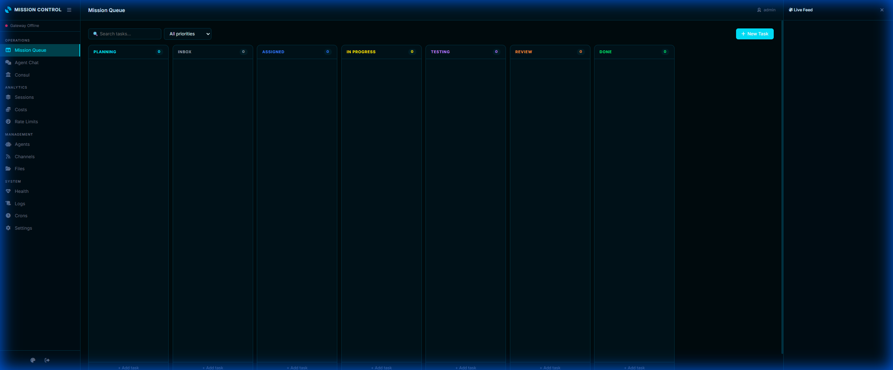

<div align="center">
  
</div>

<h1 align="center">ClawControl</h1>

<div align="center">
  <p>The official operations dashboard and web interface for the <b>OpenClaw</b> AI Agent ecosystem.</p>
</div>

---

## 🌟 Visual Overview & Features

ClawControl is a modern, single-page application built to securely manage, monitor, and directly interact with your OpenClaw agents in real-time.

### Features
- **Mission Queue (Kanban):** A fully functional drag-and-drop task board to queue up prompts, missions, and work for your AI agents. Supports custom colorful columns, compact views, and status tracking.
- **Agent Chat:** Direct 1-on-1 real-time web socket chat interface with your agents.
- **Consul (Council):** Pose complex tasks to a democratic council of your agents. They will debate, vote, and present you with reconsider or accept options for decision making.
- **Sessions & Costs:** Real-time analytics breaking down your prompt tokens, completion tokens, and dollar costs per model and session.
- **Agent Management:** A complete visual editor to create, delete, and configure roles, system prompts, quotas, and fallback models for your agent workforce.
- **Files:** Inspect, preview, and edit files within your OpenClaw workspace directly from the browser. Supports image preview and simple syntax highlighting.
- **Settings:** An intuitive visual configuration editor for `openclaw.json`. No more syntax errors! Manage your Models, Agents, Channels (Twitch/Kick), and Environment Variables all in one place.
- **Health:** Real-time system monitoring displaying CPU/RAM, active disks, gateway connection status, and quick-action buttons (restarts, data wipes).
- **Security:** Built-in Two-Factor Authentication (TOTP), Rate Limiting, Brute Force protection, and strict CSP headers.


---

## 🚀 Deployment (Coolify)

ClawControl is designed to run locally, or smoothly alongside an **OpenClaw Gateway** running on a remote server like Coolify.

*(For detailed Coolify walkthrough, see `COOLIFY-DEPLOY.md` included in this repo)*

1. Create a **New Resource > GitHub Repository** in your Coolify dashboard pointing here.
2. Select the **Build Pack** as `Docker`.
3. Set the **Port** to `7000`.
4. Create **Two Volumes** in the Storage tab to keep your data persistent:
    - `/data` -> `mc_data` (This holds the ClawControl SQLite database)
    - `/workspace` -> `mc_workspace` (This connects to your OpenClaw config files)
5. Under Environment Variables add:
   - `DASHBOARD_ALLOW_HTTP=true` (Required since Coolify SSL terminates at Traefik)
   - `OPENCLAW_GATEWAY_URL=wss://your-gateway.com` (Or internal docker URL `ws://openclaw:18789`)
   - `OPENCLAW_GATEWAY_TOKEN=your_token`
   - `DATABASE_PATH=/data/clawcontrol.db`
6. Click **Deploy**.

---

## 💻 Running Locally without Docker

If you want to run ClawControl locally on your Windows, Mac, or Linux machine alongside your local OpenClaw Node instance, follow these steps:

### Prerequisites
- Node.js 20+ installed
- OpenClaw installed somewhere on your machine

### Setup
1. Clone this repository locally or download the folder.
2. Open a terminal in the folder:
```bash
npm install
```
3. Set your environment variables (Optional, default values usually work locally). You can make a `.env.local` file:
```ini
PORT=7000
WORKSPACE_DIR=../openclaw-folder/workspace 
# Above tells ClawControl where your OpenClaw files are located
```
4. Start the server:
```bash
npm start
```
5. Open your browser and go to `http://localhost:7000`.

### First Login & Setup
Since there is no default password for security reasons, the **first person to access the URL** will be prompted with a "Create Account" screen. This account becomes the persistent Admin account.

**Highly Recommended:** Go to the Settings tab immediately and click **Setup MFA** to lock your dashboard behind Google Authenticator/Authy.
